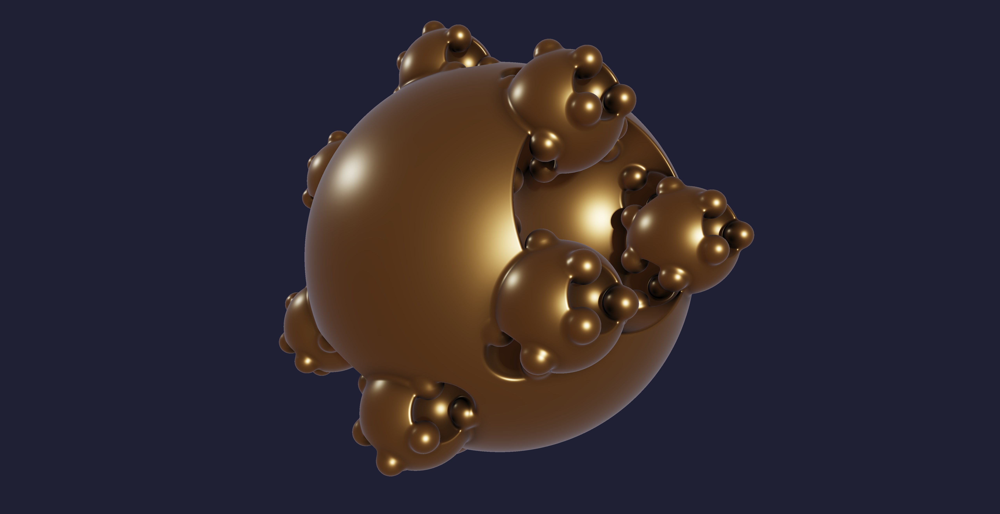

# SierpSphere

Generate 3D fractal-like structures inspired by the Sierpinski Gasket using spheres as the base seed. Boolean operations (add, subtract, intersect) are applied iteratively along polyhedral symmetry axes (tetrahedral, octahedral, icosahedral) to carve and grow complex "lace" geometry from a single sphere.



> *HQ snapshot: tetrahedral symmetry · 3 iterations · sub→add→sub · bronze PBR raymarcher*

Two rendering paths: a **real-time marching-cubes viewer** in the browser for instant feedback, and a **Python SDF engine** that extracts meshes via marching cubes and exports GLB files for 3D printing or external tools. A **Snapshot HQ** button fires a single-frame GLSL PBR raymarcher at 2× resolution for publication-quality output.

```
sierpsphere/
├── docker-compose.yml
├── sierpsphere_hq_b.png            # example HQ snapshot (bronze, tetrahedral, 3 iters)
├── grammar/
│   ├── schema.json                 # JSON Schema for the grammar DSL
│   ├── sierpinski_classic.json     # sphere · tetrahedral · sub/add/sub
│   ├── sierpinski_cube.json        # cube · tetrahedral · add/add/add
│   ├── sierpinski_octahedron.json  # octahedron · tetrahedral · sub/add/sub
│   └── sierpinski_void.json        # sphere · icosahedral · 4-step void
├── engine/
│   ├── Dockerfile
│   ├── requirements.txt
│   ├── grammar_store.py            # preset discovery + loading
│   ├── sdf.py                      # SDF evaluator + marching cubes + GLB export
│   ├── server.py                   # Flask REST API (grammar, mesh, gallery endpoints)
│   └── tests/                      # pytest unit tests
├── viewer/
│   ├── Dockerfile
│   ├── nginx.conf
│   ├── index.html                  # interactive Three.js marching-cubes viewer
│   ├── js/                         # modular pipeline: sdf · mc · ui · hq-snapshot
│   ├── tests/                      # vitest unit tests (jsdom + mocks)
│   └── package.json
├── evolver/
│   ├── Dockerfile                  # Podman image for containerised evolution
│   ├── evolver.py                  # GA orchestrator (Podman / CPU multiprocessing)
│   ├── evolver_native.py           # GA orchestrator (macOS Metal / PyTorch MPS)
│   ├── sdf_metal.py                # GPU-accelerated SDF grid sampler (MPS tensors)
│   ├── fitness.py                  # 15 trimesh-based fitness metrics + hard gates + primitive_diversity
│   ├── mutate.py                   # mutation, crossover, tournament selection, diverse_population()
│   ├── grammar_name.py             # compact name/slug encoder (Td.S.Ns4Ps2Ns1)
│   ├── config.json                 # GA hyperparameters
│   ├── requirements.txt            # Podman deps
│   ├── requirements_native.txt     # native deps (adds torch)
│   └── run_native.sh               # one-shot setup + run on macOS Metal
├── gallery/                        # evolution output — gitignored, written at runtime
│   ├── manifest.json               # epoch index (fitness history)
│   └── epoch_NNNN/                 # per-epoch: GLB meshes + grammar JSON + fitness log
├── glb-viewer/
│   └── index.html                  # standalone GLB viewer (Three.js, no build step)
│                                   # material presets · PBR sliders · turntable · 4K PNG export
└── tex/
    ├── notation.tex                # formal grammar notation (Schoenflies + step encoding)
    └── journey.tex                 # project narrative (academic / CS / LinkedIn)
```

---

## Prerequisites

- **Podman** (and `podman-compose`, or Podman 4.7+ which ships `podman compose` natively)
- Alternatively, Docker + Docker Compose work identically — just replace `podman` with `docker` everywhere below

Verify your install:

```bash
podman --version
podman compose version   # or: podman-compose --version
```

If you only have `podman-compose` (the Python shim) installed via pip:

```bash
pip install podman-compose   # if needed
```

---

## First-time setup (dev-only, volume-mounted)

### 1. Clone or enter the project

```bash
cd /path/to/sierpsphere
```

### 2. Build the containers

```bash
podman compose build
```

This builds two images with dependencies and runtime only.
Project business logic is mounted at runtime via volumes (no app code copied in runtime image).

| Image | Base | Purpose |
|-------|------|---------|
| `sierpsphere-engine` | `python:3.12-slim` | Flask API + SDF engine + marching cubes |
| `sierpsphere-viewer` | `nginx:alpine` | Static file server for the Three.js viewer |

### 3. Start the stack

```bash
podman compose up -d
```

| Service | URL | Description |
|---------|-----|-------------|
| engine | http://localhost:5000 | REST API (grammar evaluation, GLB export) |
| viewer | http://localhost:8001 | Interactive 3D viewer |

### 4. Open the viewer

Navigate to **http://localhost:8001** in your browser.

You should see the default Sierpinski-sphere rendered via marching cubes. Use the right-hand panel to tweak parameters and hit **Apply** to recompute the mesh. Use **Snapshot HQ** for a publication-quality PBR render.

### 5. Verify the API

```bash
# List available grammar presets
curl http://localhost:5000/api/grammar

# Download a GLB mesh of the classic preset
curl -o sierpinski.glb http://localhost:5000/api/mesh/sierpinski_classic
```

---

## Daily workflow

### Starting work

```bash
podman compose up -d
```

### Checking status

```bash
podman compose ps
podman compose logs -f          # tail all logs
podman compose logs -f engine   # tail engine only
```

### Stopping

```bash
podman compose down
```

### Rebuilding after code changes

If you edit Python files (`engine/sdf.py`, `engine/server.py`, `engine/grammar_store.py`), restart is usually enough (volume-mounted):

```bash
podman compose restart engine
```

If you edit the viewer (`viewer/index.html` or `viewer/js/*`), restart is usually enough (volume-mounted):

```bash
podman compose restart viewer
```

Rebuild only when dependencies or Dockerfiles change:

```bash
podman compose up -d --build
```

### Watching engine logs while developing

```bash
podman compose logs -f engine
```

The Flask server runs in debug mode and project code is already mounted from host volumes.
Use `podman compose restart engine` after Python edits when needed.

---

## Testing and coverage (containerized)

### Python (engine)

```bash
podman compose build engine
podman run --rm -v "$PWD/engine:/app" -w /app sierpsphere-engine pytest
```

### JavaScript (viewer)

Run viewer tests in the Dockerfile `test` stage:

```bash
podman build --target test -t sierpsphere-viewer-test viewer
```

This executes `vitest --coverage` with DOM/WebGL-mocked tests for UI and HQ snapshot flows.

---

## Grammar notation

Every SierpSphere grammar has a compact one-line name — readable, writable, and fully reconstructible. It follows the structure:

```
Γ = Group[Seed] : step₁ · step₂ · … · stepₙ
```

Full formal notation with alphabet, step encoding, and named grammar examples: [`tex/notation.tex`](tex/notation.tex)

Quick examples:
```
Td.S. -s4 +s2 -s1      sierpinski_classic   (display)
Td.S.Ns4Ps2Ns1         rank_01_...glb       (POSIX filename slug)
```

Gallery filenames use the slug: `rank_01_Td.S.Ns4Ps2Ns1.glb`

---

## Creating custom grammars

Drop a new JSON file into `grammar/`. The engine picks it up automatically (the directory is mounted into the container).

### Minimal example

```json
{
  "seed": {
    "type": "sphere",
    "radius": 1.0
  },
  "symmetry_group": "octahedral",
  "iterations": [
    {
      "operation": "subtract",
      "scale_factor": 0.4,
      "smooth_radius": 0.03
    }
  ]
}
```

### Full grammar reference

| Field | Type | Required | Description |
|-------|------|----------|-------------|
| `seed.type` | `sphere` \| `cube` \| `octahedron` | yes | Starting primitive |
| `seed.radius` | number > 0 | yes | Seed size |
| `seed.center` | [x,y,z] | no | Default `[0,0,0]` |
| `symmetry_group` | `tetrahedral` \| `octahedral` \| `icosahedral` | no | Default `tetrahedral` |
| **Per iteration:** | | | |
| `operation` | `subtract` \| `add` \| `intersect` | yes | Boolean op applied to parent SDF |
| `primitive` | `sphere` \| `cube` \| `octahedron` | no | Default `sphere` |
| `scale_factor` | 0 < n < 1 | yes | Child size relative to parent |
| `distance_factor` | number | no | Offset along axis. Default `1.0` |
| `smooth_radius` | number >= 0 | no | Blend softness. `0` = hard Boolean |
| `apply_to` | `all` \| `surface` \| `new` | no | Which parent nodes to expand |
| **Render hints:** | | | |
| `render.resolution` | 32–512 | no | Marching cubes grid density |
| `render.bounds` | number | no | Sampling volume half-extent |
| `render.color_mode` | `depth` \| `iteration` \| `normal` \| `solid` | no | Surface coloring strategy |

### Symmetry groups at a glance

| Group | Axes | Aesthetic |
|-------|------|-----------|
| Tetrahedral | 4 | Organic, crystalline, minimal |
| Octahedral | 6 | Denser, cubic feel |
| Icosahedral | 12 | Very dense, sphere-like lace |

### Tips for interesting results

- **Alternating subtract/add** iterations create the characteristic Sierpinski lace
- **`smooth_radius` > 0** prevents sharp edges and gives an organic look
- **`scale_factor` near 0.5** yields self-similar recursion; smaller values make sparser patterns
- **`distance_factor` < 1.0** pulls children inward, creating tighter nesting
- **`apply_to: "new"`** limits exponential growth — only the most recent children expand
- Be careful with **icosahedral + more than 3 iterations** — the operation count explodes (12^n children)

---

## Grammar evolver

A genetic algorithm searches the grammar space for forms that are both
visually complex and manufacturable as metal 3D prints (DMLS/SLM at 80 mm scale).

### Running natively on macOS (Apple Silicon — recommended)

```bash
bash evolver/run_native.sh          # fresh run
bash evolver/run_native.sh --resume # continue from last saved population
```

First run creates `.venv-evolver/` and installs PyTorch + trimesh (~2 GB, once).
The SDF grid is evaluated on Metal GPU via PyTorch MPS — ~100× faster than CPU.

### Running in Podman (cross-platform)

```bash
podman compose --profile evolve build evolver
podman compose --profile evolve run --rm evolver python evolver.py
```

Full GA design, fitness function, and Metal acceleration rationale: [`tex/journey.tex`](tex/journey.tex)

GA hyperparameters: [`evolver/config.json`](evolver/config.json)

Gallery output is written to `gallery/` (gitignored):
```
gallery/
├── manifest.json              # epoch index
└── epoch_0001/
    ├── overview.glb           # all top-5 side by side
    ├── rank_01_Td.S.Ns4Ps2Ns1.glb
    ├── rank_01_Td.S.Ns4Ps2Ns1_grammar.json
    └── fitness_log.json
```

---

## API reference

All endpoints are served by the `engine` container on port 5000.

### `GET /api/grammar`

Returns a JSON array of available grammar preset names.

```bash
curl http://localhost:5000/api/grammar
# ["sierpinski_classic"]
```

### `POST /api/evaluate`

Accepts a grammar JSON body. Returns a flat SDF description (seed + operations array) that the raymarcher consumes directly.

```bash
curl -X POST http://localhost:5000/api/evaluate \
  -H "Content-Type: application/json" \
  -d @grammar/sierpinski_classic.json
```

Response shape:

```json
{
  "seed": { "type": "sphere", "center": [0,0,0], "radius": 1.0 },
  "operations": [
    { "bool_op": "subtract", "primitive": "sphere", "center": [...], "radius": 0.5, "smooth_k": 0.02 },
    ...
  ]
}
```

### `POST /api/mesh`

Accepts a grammar JSON body. Returns a binary GLB file.

```bash
curl -X POST http://localhost:5000/api/mesh \
  -H "Content-Type: application/json" \
  -d @grammar/sierpinski_classic.json \
  -o output.glb
```

### `GET /api/mesh/<name>`

Exports a named preset from `grammar/` as GLB.

```bash
curl -o classic.glb http://localhost:5000/api/mesh/sierpinski_classic
```

---

## Viewer controls

| Control | Action |
|---------|--------|
| **Drag** | Orbit camera around the fractal |
| **Scroll** | Zoom in/out (range: 1.5–10 units) |
| **Preset menu** | Load any grammar from `grammar/` |
| **Symmetry dropdown** | Switch polyhedral axis set (tetrahedral / octahedral / icosahedral) |
| **Iterations slider** | 1–5 recursive steps |
| **Scale Factor slider** | 0.20–0.60 child/parent ratio |
| **Distance Factor slider** | Offset of children along symmetry axis |
| **Smooth K slider** | 0–0.100 blend radius for Boolean edges |
| **Mesh Resolution slider** | Grid density for marching cubes (32–128) |
| **Apply** | Recompute marching cubes mesh from current params |
| **Inline step editor** | Edit/add/reorder iteration rows (op/primitive/scale/distance/smooth/apply_to) |
| **Grammar JSON preview** | Live JSON block for copy/inspection before export |
| **Save Grammar** | Download current active grammar as JSON |
| **Snapshot HQ** | Single-frame PBR raymarcher → save PNG at 2× resolution |
| **Download GLB** | Send grammar to API, download watertight GLB mesh |

Safety guardrails are enabled in the viewer to avoid GPU lockups on integrated graphics:
- realtime meshing is blocked above a max operation count
- snapshot is blocked above a stricter operation threshold
- high mesh resolution is clamped to a safe value

The viewer runs **entirely client-side** for interactive rendering (marching cubes in JavaScript). The API is only needed for high-resolution GLB export and loading presets by name.

---

## Exporting for external use

### GLB for 3D printing or Blender

```bash
# From a preset
curl -o fractal.glb http://localhost:5000/api/mesh/sierpinski_classic

# From a custom grammar
curl -X POST http://localhost:5000/api/mesh \
  -H "Content-Type: application/json" \
  -d @grammar/my_custom.json \
  -o fractal.glb
```

The GLB can be opened directly in Blender, imported into slicer software, or viewed in any GLTF viewer.

### Higher resolution meshes

Set `render.resolution` in your grammar JSON (up to 512). Higher values produce smoother surfaces but take longer:

| Resolution | Grid points | Approx. time |
|------------|-------------|---------------|
| 64 | 262k | < 1s |
| 128 | 2M | ~2–5s |
| 256 | 16.7M | ~30–60s |
| 512 | 134M | several minutes, ~8GB RAM |

---

## Cleanup

### Stop and remove containers

```bash
podman compose down
```

### Remove built images

```bash
podman compose down --rmi all
```

### Remove everything including volumes

```bash
podman compose down --rmi all --volumes
```

### Prune dangling images after rebuilds

```bash
podman image prune -f
```

---

## Ideas for future tuning

### Grammar / geometry
- **Mixed primitives per iteration** — subtract spheres, add cubes, intersect octahedra; each level can use a different `primitive` to break the uniform roundness
- **Non-uniform scale per axis** — currently all symmetry vertices use the same `scale_factor`; allowing per-vertex overrides would break the symmetry elegantly
- **`distance_factor` < 1.0** — pull children inside the parent surface for tightly nested, coral-like forms instead of protruding balls
- **`apply_to: "all"`** — expand from every prior level simultaneously for denser, more fractal-like branching (warning: count explodes fast)
- **Noise-perturbed centers** — add a small random offset to child centers per iteration for organic, non-symmetric variants
- **Hybrid symmetry** — tetrahedral first iteration, icosahedral second; mix groups across levels

### Rendering (Snapshot HQ shader)
- **Environment map IBL** — replace the two-light model with a cube-map for photorealistic reflections; bronze especially benefits from a warm studio HDR
- **Subsurface scattering** — thin areas of the fractal (small subtracted spheres) could glow slightly if treated as translucent
- **Depth of field** — bokeh blur on the background/foreground for a macro-photography feel
- **Chromatic iridescence** — vary the Fresnel F0 tint by normal angle to simulate patinated bronze or oil-slick surfaces
- **Progressive accumulation** — accumulate multiple jittered frames for anti-aliasing without doubling resolution
- **Volumetric fog** — a thin atmospheric layer between camera and object adds depth on dark backgrounds

### Performance
- **GPU marching cubes** — offload the grid sampling to a WebGL compute pass; the JS CPU marching cubes is the current bottleneck at resolution > 64
- **Sparse voxel octree** — skip empty regions during SDF evaluation; significant speedup at low iteration counts where most of the volume is empty
- **Cached SDF grid** — store the Float32 grid and only re-run marching cubes when camera-independent params change
- **Web Worker** — run the marching cubes loop in a worker thread to avoid blocking the UI during recompute

### Export / integration
- **Watertight manifold check** — run `trimesh.repair.fill_holes()` before GLB export to guarantee printability
- **USDZ export** — for AR Quick Look on iOS/macOS (`trimesh` supports it natively)
- **Grammar evolution / GA** — a simple genetic algorithm over grammar params with a fitness function (surface area / volume ratio, fractal dimension estimate) to auto-discover interesting forms
- **Three.js MeshStandardMaterial** — apply the same bronze PBR params to the real-time mesh so the interactive view matches the HQ snapshot

---

## Troubleshooting

### "Address already in use" on port 5000 or 8080

```bash
# Find what's using the port
lsof -i :5000
# Kill it or change the port mapping in docker-compose.yml
```

### Viewer shows "Loading..." but no fractal

The raymarcher runs entirely in the browser — no API needed for the default view. Check the browser console for WebGL errors. Ensure your browser supports WebGL 1.0+.

### GLB download fails

Verify the engine is running:

```bash
podman compose ps
podman compose logs engine
```

Common causes: missing Python dependencies (rebuild the image), grammar JSON syntax errors.

### Raymarcher is slow

Reduce iterations or switch from icosahedral to tetrahedral. Each iteration multiplies the SDF operation count by the number of symmetry axes (4, 6, or 12). Three iterations with icosahedral = 12 + 144 + 1728 = 1884 SDF evaluations per pixel per frame.

### Podman on macOS

Podman on macOS runs containers inside a Linux VM. Make sure it's initialized:

```bash
podman machine init    # first time only
podman machine start
```
